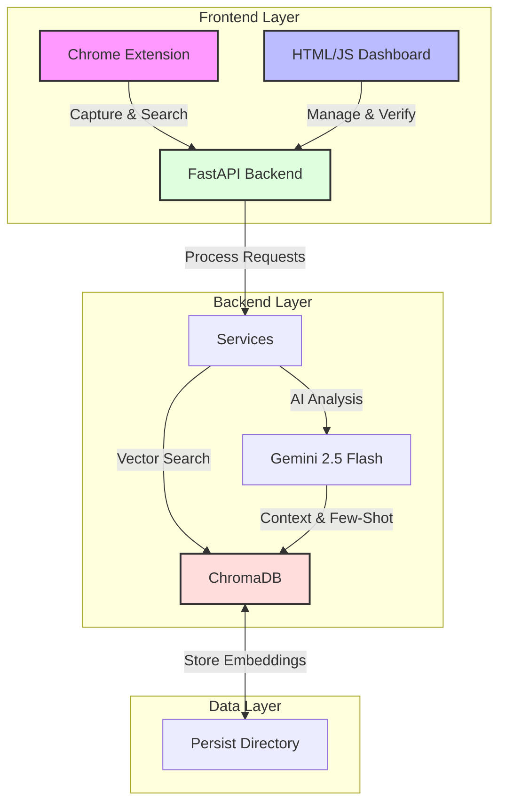

# Knowledge-Weaver 🕸️

**Turning generic chat logs into a verified Source of Truth.**

Knowledge-Weaver is a "Human-in-the-Loop" system that captures valuable information from team chats, verifies it, and makes it instantly searchable. It bridges the gap between ephemeral conversations and permanent organizational knowledge.

## Architecture

The system uses a "Frankenstein" architecture, stitching together powerful components to create a seamless workflow:

The system is styled with a **Custom Dark Theme** (Spider Theme) to ensure a premium, consistent look across all components.

## Core Concepts

### 🕷️ The Spider (Verification)
The "Spider" represents the verification layer. It ensures that only high-quality, human-reviewed information enters the permanent knowledge base.
- **Source of Truth**: Content marked as `verified_human` is treated as gold standard.
- **Active Learning**: The AI learns from these verified examples to improve future suggestions.

### 🕸️ The Weaver (Capture)
The "Weaver" is the capture mechanism (Chrome Extension & Auto-Ingestion).
- **Draft Mode**: Captured content starts as `draft` or `verified_ai`.
- **Low Friction**: Designed to be as effortless as possible to encourage high-volume capture.

## 🤖 The AI-Native Workflow

We don't just write code; we build systems that can be understood and operated by AI agents. This philosophy drives our development process:

### 1. Browser Subagent & Self-Healing
We use AI agents to evaluate the application, not just run static scripts.
- **Agent-Based Testing**: Agents navigate the UI like a human, interacting with real elements.
- **Self-Healing**: If an agent hits a barrier (e.g., a changed selector), it attempts to fix the issue or logs it for review, ensuring our test suite remains resilient.

### 2. Universal Design (WCAG)
"If a robot can use it, so can a human."
- **Data-Testid Strategy**: By enforcing `data-testid` attributes for our robot agents, we inadvertently create a robust structure for human assistive technologies (screen readers).
- **Accessibility First**: Our commitment to robot-accessibility guarantees high WCAG standards for all users.

### 3. Evaluation vs. Labeling
We are shifting the paradigm from manual data labeling to operational reliability.
- **Focus on Ops**: Instead of spending hours labeling data, we focus on evaluating how well the system performs in real-world scenarios.
- **Reliability Metrics**: We measure success by the system's ability to recover from errors and maintain a high "Golden Path" completion rate.

## Key Features

### 1. Human-in-the-Loop Verification
AI suggests, Humans decide.
- **Capture**: AI suggests categories/tags.
- **Review**: Users verify/edit suggestions.
- **Search**: Verified content is boosted.

### 2. Active Learning (Dynamic Few-Shot Prompting)
The system gets smarter as you use it.
- **Feedback Loop**: When you edit a tag or category, the system records this as a "correction".
- **Context Injection**: Future analysis requests include these corrections as few-shot examples.
- **Result**: The AI mimics your team's specific style.

### 3. Gap-to-Gold
Identify and fill knowledge gaps.
- **Tracking**: Queries with zero results are tracked.
- **Resolution**: Experts can answer these gaps directly from the dashboard.

### 4. Recycle Bin (Soft Deletes)
- **Safety**: Deleted items are soft-deleted (hidden, not destroyed).
- **Recovery**: Restore items via the Recycle Bin tab.

## Getting Started

### Prerequisites
- Python 3.13+
- Chrome Browser

### Installation
1. Clone the repository
2. Install dependencies: `pip install -r requirements.txt`
3. Set up environment variables (API Keys)

### Running the System
1. **Backend**: `uvicorn backend_api.main:app --reload`
2. **Dashboard**: Open `app_dashboard/index.html` (Served via Python HTTP or FastAPI Static).
3. **Extension**: Load `app_extension` as an unpacked extension in Chrome.
