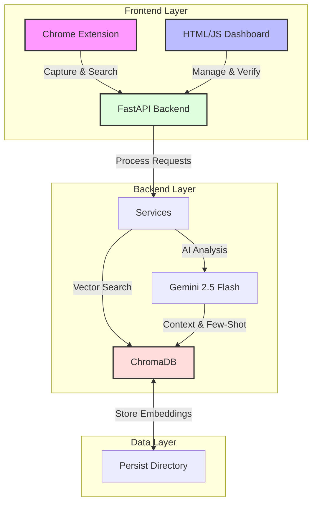

# Knowledge-Weaver 🕸️

**Turning generic chat logs into a verified Source of Truth.**

Knowledge-Weaver is a "Human-in-the-Loop" system that captures valuable information from team chats, verifies it, and makes it instantly searchable. It bridges the gap between ephemeral conversations and permanent organizational knowledge.

## Architecture

The system uses a "Frankenstein" architecture, stitching together powerful components to create a seamless workflow:

The system is styled with a **Custom Dark Theme** (Spider Theme) to ensure a premium, consistent look across all components.

## Core Concepts

### 🕷️ The Spider (Verification)
The "Spider" represents the verification layer. It ensures that only high-quality, human-reviewed information enters the permanent knowledge base.
- **Source of Truth**: Content marked as `verified_human` is treated as gold standard.
- **Active Learning**: The AI learns from these verified examples to improve future suggestions.

### 🕸️ The Weaver (Capture)
The "Weaver" is the capture mechanism (Chrome Extension & Auto-Ingestion).
- **Draft Mode**: Captured content starts as `draft` or `verified_ai`.
- **Low Friction**: Designed to be as effortless as possible to encourage high-volume capture.

## 🤖 The AI-Native Workflow

Knowledge-Weaver was built using a "Robot-First" philosophy. We treat AI Agents not just as coding assistants, but as First-Class Users of the application.

### 1. Evaluation > Labeling
Following the [suspicious link removed], we shifted our focus from manual data entry to Agent Evaluation. We use autonomous agents to run "Golden Path" regression tests on every commit, ensuring the system is operationally reliable.

### 2. Self-Healing Capabilities
By equipping our Dashboard with stable data-testid selectors, we enable AI agents (like the Antigravity Browser Subagent) to:
- **Navigate the UI** with 100% reliability.
- **Identify Barriers**: If an element is blocked, the agent logs the barrier.
- **Self-Heal**: The agent has the authority to fix broken selectors in the code to unblock itself.

### 3. Universal Design (Robot-First = Human-Ready)
We discovered that building for robots enforces strict semantic HTML and clear navigation paths. This "AI-Native" approach naturally results in a highly accessible application for human users relying on assistive technologies (Screen Readers), achieving a higher standard of Universal Design.

## Key Features

### 1. Human-in-the-Loop Verification
AI suggests, Humans decide.
- **Capture**: AI suggests categories/tags.
- **Review**: Users verify/edit suggestions.
- **Search**: Verified content is boosted.

### 2. Active Learning (Dynamic Few-Shot Prompting)
The system gets smarter as you use it.
- **Feedback Loop**: When you edit a tag or category, the system records this as a "correction".
- **Context Injection**: Future analysis requests include these corrections as few-shot examples.
- **Result**: The AI mimics your team's specific style.

### 3. Gap-to-Gold
Identify and fill knowledge gaps.
- **Tracking**: Queries with zero results are tracked.
- **Resolution**: Experts can answer these gaps directly from the dashboard.

### 4. Recycle Bin (Soft Deletes)
- **Safety**: Deleted items are soft-deleted (hidden, not destroyed).
- **Recovery**: Restore items via the Recycle Bin tab.

### 5. Rich Content Editing
- **Full Control**: Edit summaries and content with a rich text interface.
- **Seamless Updates**: Changes are immediately reflected in the knowledge base.

### 6. Visual Source Verification
- **Context Preservation**: Captures screenshots of the source material (e.g., chat threads).
- **Trust**: Verify the origin of information with a visual reference.

## Getting Started

### Prerequisites
- Python 3.13+
- Chrome Browser

### Installation
1. Clone the repository
2. Install dependencies: `pip install -r requirements.txt`
3. Set up environment variables (API Keys)

### Running the System
1. **Backend**: `uvicorn backend_api.main:app --reload`
2. **Dashboard**: Open `app_dashboard/index.html` (Served via Python HTTP or FastAPI Static).
3. **Extension**: Load `app_extension` as an unpacked extension in Chrome.
